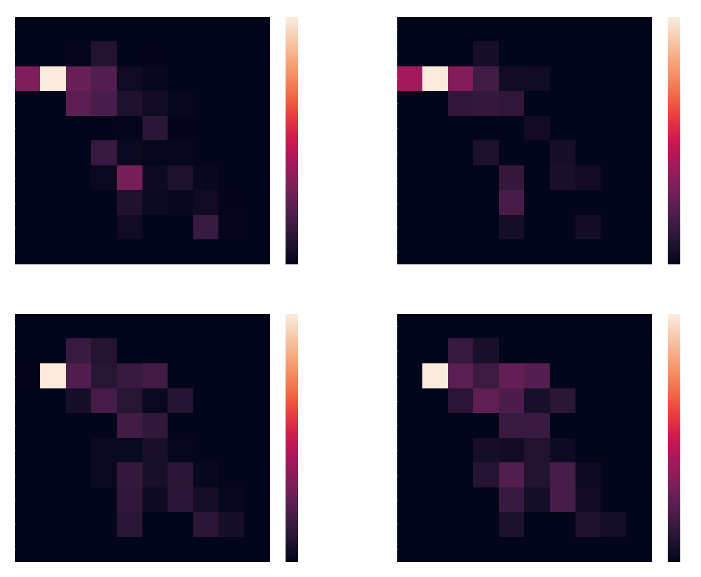

# Executive Summary

### Overview

The objective of this project was to indicate the presence of West Nile Virus(WNV) for the city of Chicago. We use Time, Location and Species of Mosqitoes to build a model to indicate the presence of the virus.

We conducted extensive research on the virus, mode of transmission, symptoms, treatments and some statistical information. These are summarized as follows:

<ul>
    <li>Season - May through October</li>
    <li>Mode of transmission - Through the bite of an infected adult mosquito</li>
    <li>Symptoms             - Range from fever to death</li>
    <li>Statistics           - 1/5   show minor/non severe symptoms, 1/150 show severe/fatal symptoms</li>
</ul>

We studied the lifycyle of a mosquito and concluded that it is easiest to terminate/control the population of mosquitoes during the egg,larvae and pupa life-cycle stages of mosquito. A statement released by EPA indicated the risk of aerial spraying range from low acute toxicity at lower concentrations to fatal/severe toxicity at higher concentrations.

### Visualizations

We used Matplotlib for more basic line charts, for instance the counts of each species over time:

We used Seaborn for heatmapping, for example, West Nile Virus presence in geographic zone per year:

This data helped us to conclude that the ideal weather for spread of WNV through mosquitoes are periods of rain followed by humid weather and sunshine. Mosquitoes really thrive under this condition and we obtained a pretty high correlation when we saw similar trends in the weather.

### Modeling

The next step involved mapping out our workflow and fitting and scoring a regression model. We also decided to bootstrap our data to better balance out the number of classes in our classification problem. A regression model was instantiated and fitted to get a count of the number of mosquitoes. We used the following regressor models and evaluated the cross validation scores to check for the accuracy of the model and these are the results we obtained.
   a) Bagging Regressor       - 0.225
   b) Random Forest Regressor - 0.220
   c) Extra Trees Regressor   - 0.198
   d) ADA Boost Regressor     - 0.133

We used the mosquito count from our regression problem to use as a feature for our classification problems. We used different classification models
   a) Random Forest Classifier
   b) Extra Trees Classifier
   c) Support Vector Classifier
   d) ADA Boost Classifier
   e) Logistic Regression Classifier

The highest accuracy in our Kaggle score was achieved through the Logistic Regression Classifier which came out to around 64%

### Conclusion

As a part of our conclusions, we suggested the use of some alternative chemical pesticides and natural ways to combat mosquitoes. We finished our project by conducting some cost analysis and coming to a conclusion that aerial spraying must be used only we see a total number of 75 cases within the city of Chicago. This number was calculated keeping in mind ecological factors, effects on human beings and animals and cost factor.