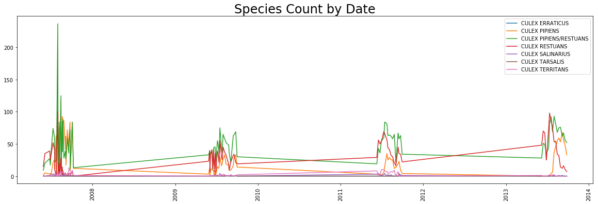
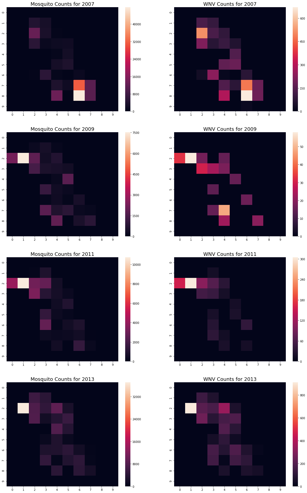
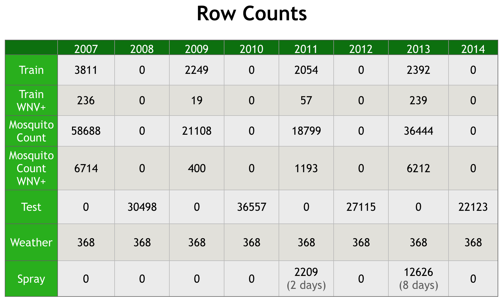

# Executive Summary

### Overview

The objective of this project was to indicate the presence of West Nile Virus(WNV) for the city of Chicago. We used time, location, trap number, and a feature-engineered mosquito count column to build models to determine the presence of the virus per trap per species.

In order to better understand the bigger picture, we researched the mode of transmission, symptoms, treatments and some statistical information. These are summarized as follows:

<ul>
    <li>Observed Time Period - May through October</li>
    <li>Mode of transmission - Via the bite of an infected adult mosquito</li>
    <li>Symptoms - Range from fever and skin rash to convulsions to loss of consciousness/coma and in rare cases fatality</li>
    <li>Statistics - 1/5 show minor symptoms, 1/150 show severe/fatal symptoms</li>
</ul>

We studied the lifecycle of a mosquito and concluded that it is easiest to terminate/control the population of mosquitoes during the egg, larval and pupa life-cycle stages of mosquito. A statement released by EPA indicated the risk of aerial pesticide spraying to humans ranges from low acute toxicity at lower concentrations to fatal/severe toxicity at higher concentrations.

### Visualizations

We used Matplotlib for more basic line charts, for instance the counts of each species over time:

We used Seaborn for heatmapping, for example, West Nile Virus presence in geographic zone per year:

Our weather data and research seemed to indicate that periods of rain followed by humid weather and sunshine were ideal breeding conditions for mosquitos which have a three-day gestation period.

### Modeling

To get an idea of what we were dealing with, it was useful to break the numbers out into a table:

This allowed us to determine, at least for this project, that the recorded spray data was irrelevant since it occurred in off-years from the recorded mosquito counts and since pesticide is required by the EPA to break down in a biologically safe way within a short period of time. Also based on the clear imbalance in the count numbers, we bootstrapped our data to avoid bias.

The next step involved mapping out our workflow and fitting and scoring a regression model. We used the following regressor models and evaluated the cross validation scores to check the accuracy of the model using:

<ul>
   <li>Bagging Regressor</li>
   <li>Random Forest Regressor</li>
   <li>Extra Trees Regressor</li>
   <li>ADA Boost Regressor</li>
</ul>

We used the mosquito count from our regression problem as an engineered feature for our classification problems by moving the count into the dummied mosquito species columns. We then tried different classification models:

<ul>
   <li>Random Forest Classifier
   <li>Extra Trees Classifier
   <li>Support Vector Classifier
   <li>ADA Boost Classifier
   <li>Logistic Regression Classifier
</ul>

The highest accuracy in our Kaggle score was achieved through the Logistic Regression Classifier which came out to around 64%.

### Conclusion

As a part of our conclusions, we suggested the use of an alternative to pesticide since our data did not show any correlation between spray years and reduced mosquito populations. Specifically, bats have been shown to be very effective in controlling insect populations in Austin, TX and there are already eight native bat species which populate the downtown Chicago area. Making the area more bat-friendly combined with a large-scale PR and education campaign could result in saved lives.

We finished our project by conducting some cost analysis and coming to a conclusion that aerial spraying must be used only we see a total number of 75 cases within the city of Chicago in a given year and only as a stop-gap measure. This number was calculated keeping in mind ecological factors, effects on human beings and animals and cost.
